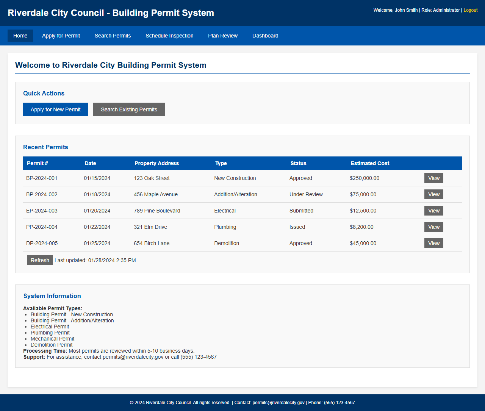
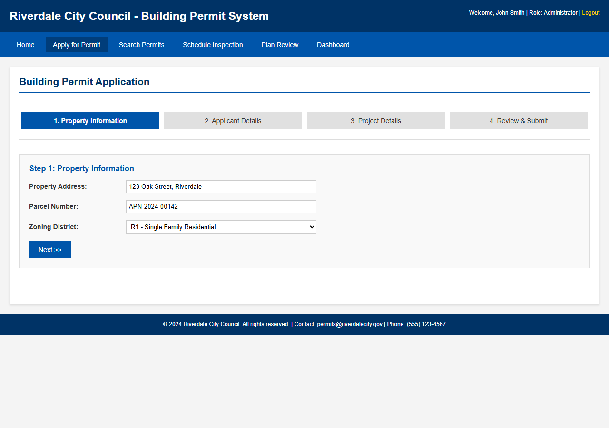
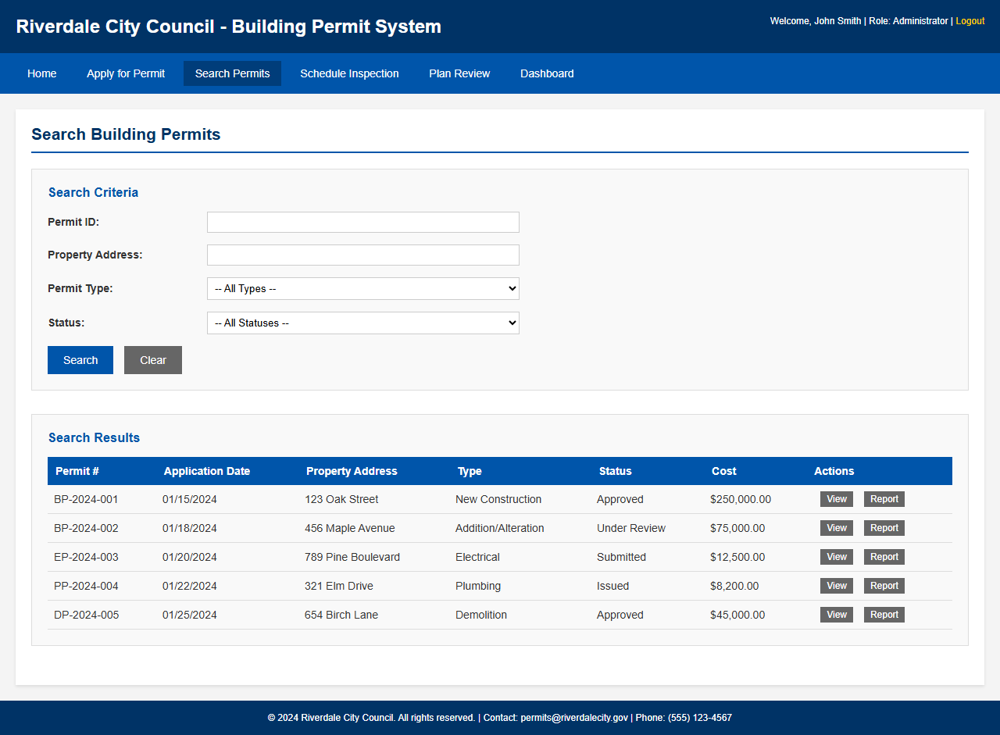
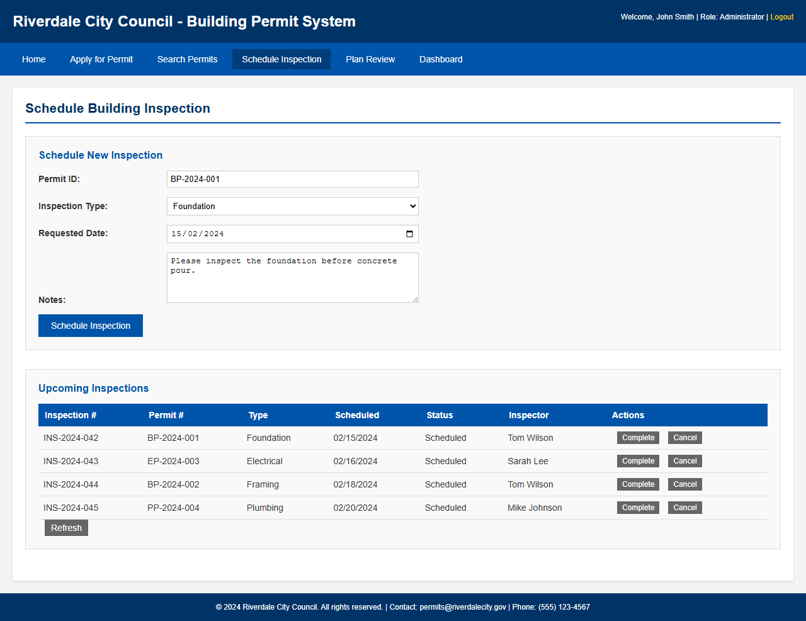
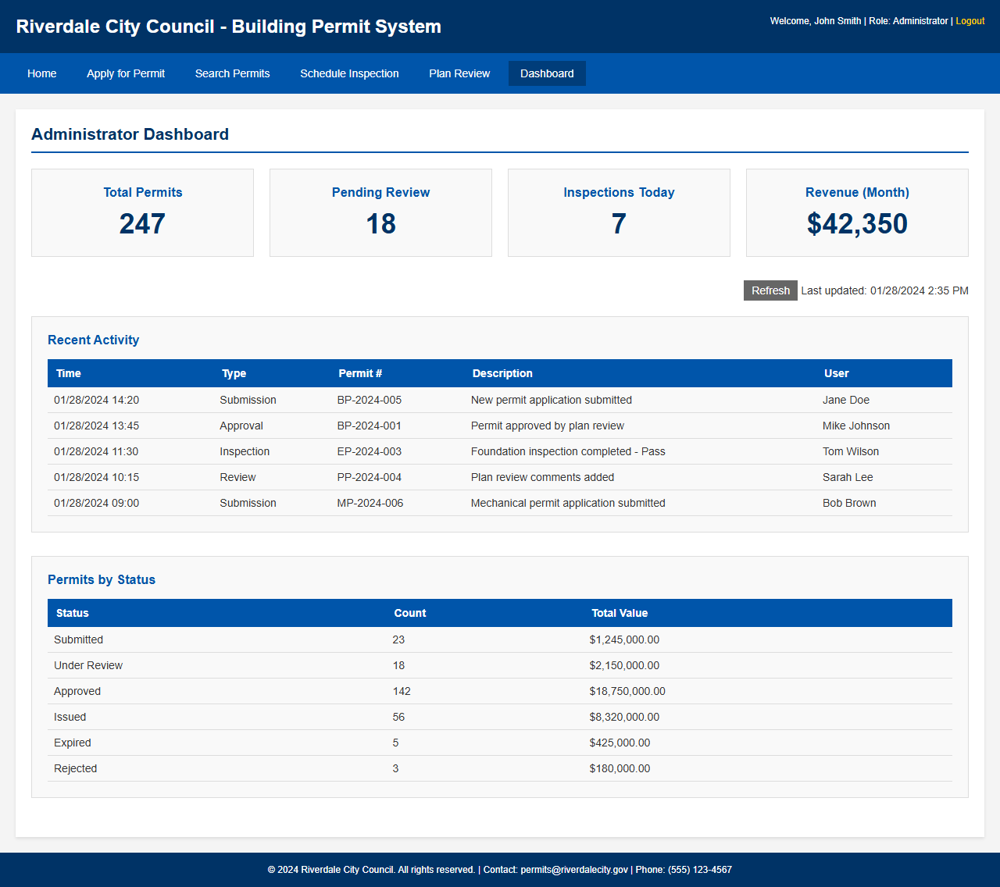

## Legacy Application Overview

The Riverdale City Building Permit System is an ASP.NET Web Forms (.NET Framework 4.8) application used by Riverdale City Council for managing building permits, inspections, and plan reviews. The application exhibits classic Web Forms anti-patterns: ViewState, UpdatePanels, DataSets, and stored procedure–driven business logic that must be modernized using the Spec2Cloud methodology.

### Home Page & Navigation

The landing page provides quick action buttons, a recent permits grid, and system information including available permit types and processing times.

### Permit Application Wizard

A multi-step wizard (4 steps) guides users through submitting new building permit applications, collecting property information, applicant details, project details, and a review/submit step. This wizard relies heavily on ViewState for state management.

### Search & Data Grid

Permits can be searched by ID, address, type, or status. Results display in a paginated GridView with ObjectDataSource binding — a pattern that will be replaced with EF Core queries and Blazor components.

### Inspection Scheduling

Inspectors schedule building inspections (Foundation, Framing, Electrical, Plumbing, Mechanical, Final) against existing permits, with a table of upcoming inspections rendered via UpdatePanel for partial page updates.

### Administrator Dashboard

The admin dashboard shows stat cards (Total Permits, Pending Review, Inspections Today, Monthly Revenue), a recent activity log, and permits-by-status summary — all driven by stored procedures that will be refactored into domain services.

---

## Screenshots

The Riverdale City Building Permit System is an ASP.NET Web Forms (.NET Framework 4.8) application used by Riverdale City Council for managing building permits, inspections, and plan reviews.

### Home Page
The landing page shows quick action buttons, a recent permits grid, and system information including available permit types and processing times.

### Permit Application
A multi-step wizard (4 steps) for submitting new building permit applications. Collects property information, applicant details, project details, and provides a review/submit step.

### Permit Search
Search permits by ID, address, type, or status. Results display in a paginated grid with View and Report actions per row.

### Inspection Schedule
Schedule building inspections (Foundation, Framing, Electrical, Plumbing, Mechanical, Final) against existing permits, with a table of upcoming inspections.

### Administrator Dashboard
Overview dashboard with stat cards (Total Permits, Pending Review, Inspections Today, Monthly Revenue), recent activity log, and permits-by-status summary.

